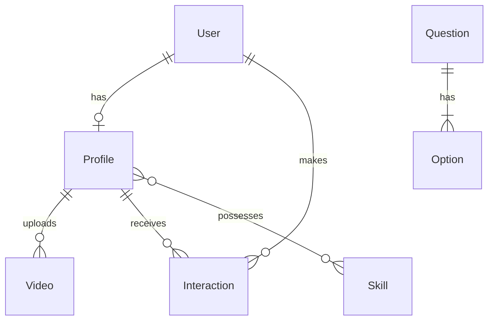

# System Architecture

## Tech Stack

- **Database**: PostgreSQL
- **ORM**: Prisma 7 (Translates schema -> SQL. Generates JS client).
- **Backend**: Node.js + Express
- **Frontend**: Next.js (React)

## How Prisma Works Here

1. `prisma/schema.prisma` acts as the single source of truth.
2. `npx prisma migrate dev` creates actual PostgreSQL tables from the schema.
3. `npx prisma generate` creates the `prisma-client` used in our backend code.
4. App uses `prisma.user.findMany()` instead of raw SQL strings.

## Database Schema

*(See `prisma/schema.prisma` for exact fields and relations).*
