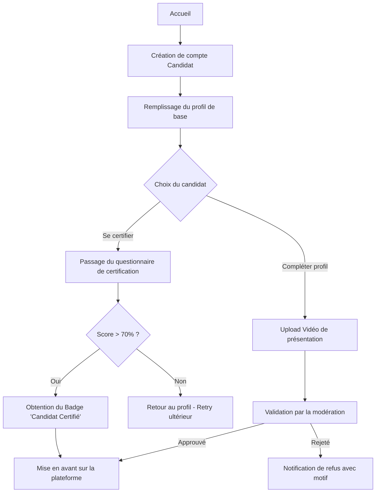
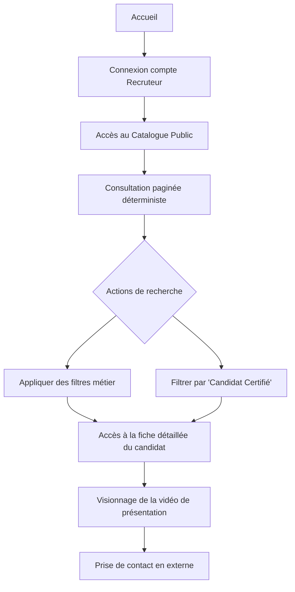
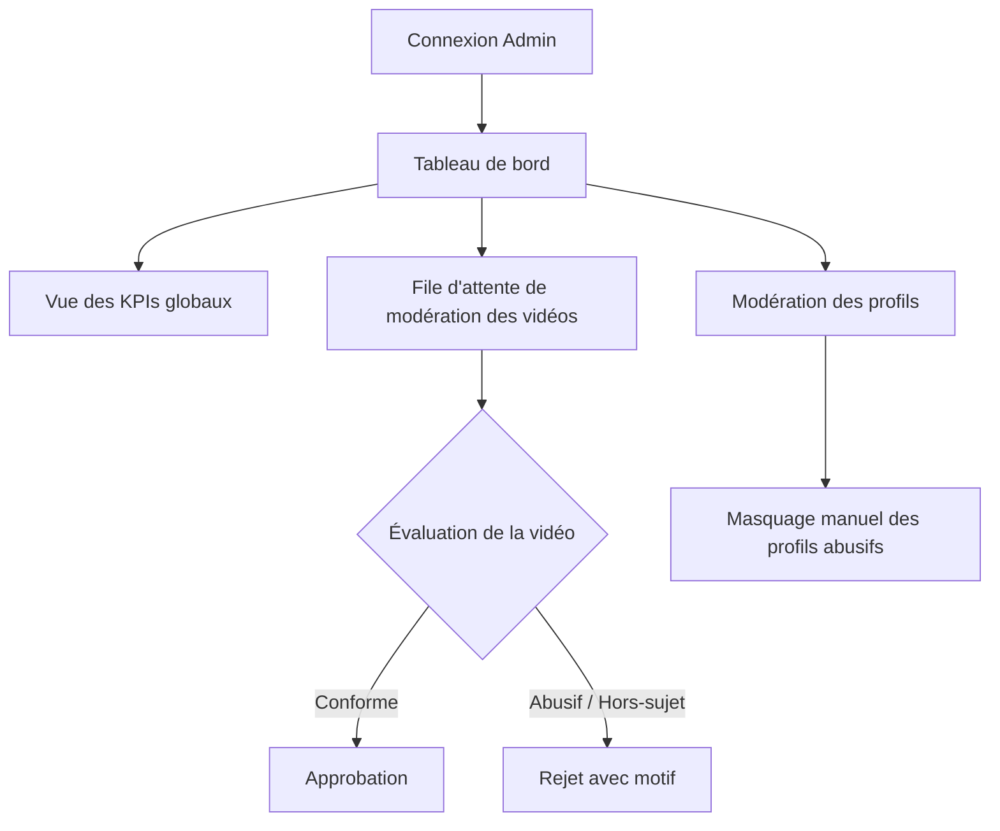

# Parcours Utilisateur (User Journeys)

Les schémas ci-dessous décrivent les parcours types des trois rôles principaux de la plateforme ProfilsActifs, en accord avec les spécifications fonctionnelles actuelles.

## 1. Parcours Candidat (Recherche d'emploi)

## 2. Parcours Recruteur

## 3. Parcours Administrateur (Modération)

